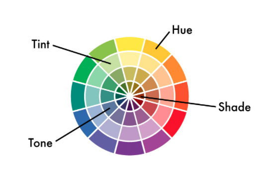

<!-- I read up about color theory on the internet and combined a few different resources to make the article below. I used markdown for the first time to format the text.
 -->
# Color Theory

## What is Color Theory?

Color theory are guidelines that designers use to communicate with users through appealing color schemes in visual interfaces. To help pick the best colors, designers use a color wheel and refer to extensive collected knowledge about human optical ability, psychology and culture.

## The history of Color Theory

Sir Isaac Newton established color theory when he invented the color wheel in 1666. Newton understood **colors as human perceptions** (not absolute qualities) **of wavelengths of light**. By systematically categorising colors, he defined them into groups.

### The three groups of colors are:

1. **Primary** (red, blue, yellow)
2. **Secondary** (mixes of primary colors)
3. **Tertiary** (or **intermediate** – mixes of primary and secondary colors)

Following Newton’s findings, the study of color advanced to cover the properties of color in its two forms; print/paint and screen/light—and in a variety of fields, from art to astronomy. 

### The colors properties are:

- **Hue** refers to the pure, saturated colors seen on the color wheel above.
- **Tints** are achieved by incorporating elements of white to brighten and desaturate a single hue. Tints of a color are often much calmer than their saturated counterparts.
- **Tones** are achieved by adding gray to a hue, dulling the overall chroma.
- **Shades** are achieved by adding portions of black to a single hue, creating a darker hue.
- **Saturation** refers to the overall intensity, or chroma, in a color. A pure hue is more saturated than its tint or tone.
- **Value** refers to the general lightness or darkness of a color. A lighter hue has more value than a darker hue.

In UX design you need a good understanding of color theory to craft visually pleasing and functional designs for your users.

## The magic of Color Scheme in the creation of a powerful Design

In screen design, designers use the additive color model, where red, green and blue are the primary colors. Just as you need to strategically place images and other elements in visual design, your color choices likewise should optimize your users’ experience in interfaces that have high usability.  When starting your design process, you can consider using any of these main color schemes:

- **Monochromatic** – Take one hue and create other elements from different shades and tints of it.
- **Analogous** – Use three colors located beside one another on the color wheel (e.g., orange, yellow-orange and yellow to show sunlight). A variant is to mix white with these to form a “high-key” analogous color scheme (e.g., flames).
- **Complementary** – Use “opposite color” pairs—e.g., blue/yellow—to maximize contrast.
- **Split-Complementary** (or **Compound Harmony**) – Add colors from either side of your complementary color pair to soften contrast.
- **Triadic** – Take three colors which are equally distant on the color wheel (i.e., 120° apart: e.g., red/blue/yellow). These colors may not be vibrant, but the scheme can be as it maintains harmony and high contrast. It’s easier to make visually appealing designs with this than with a complementary scheme.
- **Tetradic** – Take four colors that are two sets of complementary pairs (e.g., orange/yellow/blue/violet) and choose one dominant color. This allows rich, interesting designs. However, watch the balance between warm and cool colors.
- **Square** – A variant of tetradic; you find four colors evenly spaced on the color wheel (i.e., 90° apart). Unlike tetradic, square schemes can work well if you use all four colors evenly.

## The importance of colors being on brand

Your colors must reflect your design’s goal and brand’s personality. You should also apply color theory to optimize a positive psychological impact on users. So, you should carefully determine how the color temperature (i.e., your use of warm, neutral and cool colors) reflects your message. For example, you can make a neutral color such as grey warm or cool depending on factors such as your organization’s character and the industry.

## The power of color in accessibility and cultural context

The right contrast is vital to catching users’ attention in the first place. The vibrancy you choose for your design is likewise crucial to provoking desired emotional responses from users. How they react to color choices depends on factors such as gender, experience, age and culture. In all cases, you should design for accessibility.  – e.g., regarding red-green color blindness. Through UX research, you can fine-tune color choices to resonate best with specific users. Your users will encounter your design with their own expectations of what a design in a certain industry should look like. That’s why you must also design to meet your market’s expectations geographically. For example, blue—an industry standard for banking in the West—also has positive associations in other cultures. However, some colors can evoke contradictory feelings from certain nationalities (e.g., red: good fortune in China, mourning in South Africa, danger/sexiness in the USA).  A good practice is to use an usability testing to make sure that your color choices are user friendly for everyone.

As you have learned by now, Color Theory is a vital aspect in the world of design. It touches on various topics, not only the look of a design but also the feel and how people in different societies perceive the design based on the color schemes used and their cultural color perceptance.

*References*
The Color Theory literature:
	[Main article used for text](https://www.interaction-design.org/literature/topics/color-theory)
    [Color in design](https://www.shutterstock.com/blog/complete-guide-color-in-design)

Markdown:
    [What is Markdown](https://en.wikipedia.org/wiki/Markdown#:~:text=Markdown%20is%20a%20lightweight%20markup,in%20its%20source%20code%20form.)
 	[A list of Markdown syntax elements](https://www.markdownguide.org/cheat-sheet/)   
    [Tutorial for beginners on Youtube](https://https://www.youtube.com/watch?v=0_tO8HgJiLQ)

